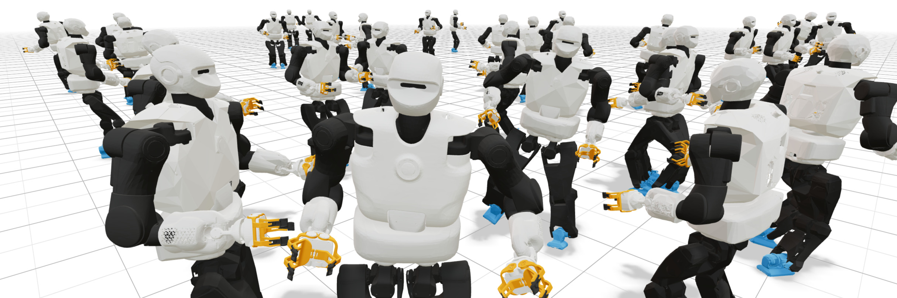

[](https://github.com/astral-sh/uv)
[](https://mujocolab.github.io/mjlab/v1.1.1/index.html)

# PAL Robotics in mjlab

This repository showcases the implementation of [PAL Robotics](https://pal-robotics.com/)' robots in [mjlab](https://github.com/mujocolab/mjlab).



## What is mjlab?

mjlab brings the [Isaac Lab](https://isaac-sim.github.io/IsaacLab/main/index.html) API to [MuJoCo Warp](https://mujoco.readthedocs.io/en/latest/mjwarp/index.html).
It's lightweight, easy to install, and has been validated for sim-to-real transfer on the G1 and Go1 robots for RL locomotion and motion imitation.
See the [announcement thread](https://x.com/kevin_zakka/status/1972757435707424898) for videos, or read about the [motivation behind mjlab](https://github.com/mujocolab/mjlab/blob/main/docs/motivation.md).

## Installation

Install uv.
```bash
curl -LsSf https://astral.sh/uv/install.sh \| sh
```

Clone the repository.

```bash
git clone https://github.com/pal-robotics/pal_mjlab.git
cd pal_mjlab
uv sync
```

## Quick Start

List available environments.

```bash
uv run list_envs --keyword pal
```

Test with dummy agents.

```bash
uv run play Mjlab-Velocity-Flat-Pal-Kangaroo --agent zero    # send zero actions
uv run play Mjlab-Velocity-Flat-Pal-Kangaroo --agent random  # send random actions
```


## Velocity Tracking

Train a locomotion policy.

```bash
uv run train Mjlab-Velocity-Flat-Pal-Kangaroo --env.scene.num-envs 4096
```

Evaluate a trained policy.

```bash
uv run play Mjlab-Velocity-Flat-Pal-Kangaroo --wandb-run-path your-org/mjlab/run-id
```


## Motion Imitation

We added support to [GMR](https://github.com/YanjieZe/GMR) to retarget animations from the [LaFAN1 dataset](https://github.com/ubisoft/ubisoft-laforge-animation-dataset) for PAL robots (KANGAROO and Talos).

### Retargeting a new motion

First, use GMR to retarget and convert a motion file. Note that for convenience we provide a few retargeted motions under `motions` folder.

Then convert the CSV to NPZ format.

```bash
uv run -m pal_mjlab.scripts.csv_to_npz \
    --input-file motions/kang_walk.csv \
    --output-name kang_walk \
    --input-fps 30 \
    --output-fps 50 \
    --robot-name kangaroo \
    --render True
```

### Training and evaluation

Train.

```bash
uv run train Mjlab-Tracking-Flat-Pal-Kangaroo \
    --registry-name your-org/csv_to_npz/kang_walk \
    --env.scene.num-envs 4096
```

Evaluate.

```bash
uv run play Mjlab-Tracking-Flat-Pal-Kangaroo --wandb-run-path your-org/mjlab/run-id
```

## Results

<video src="https://github.com/user-attachments/assets/32c0e534-ead9-400e-afe5-42174a6b739b" controls muted loop playsinline style="width:100%;"></video>

## Contributing

Contributions are welcome!
Please open an issue to discuss proposed changes or report bugs.
As mjlab is in early development, breaking changes may occur—thank you for your patience.

## Acknowledgements

Thanks to the teams behind [mjlab](https://github.com/mujocolab/mjlab), [PAL Robotics](https://pal-robotics.com/), [MuJoCo Warp](https://mujoco.readthedocs.io/en/latest/mjwarp/index.html), [Isaac Lab](https://isaac-sim.github.io/IsaacLab/main/index.html), and the [Inria HUCEBOT Team](https://team.inria.fr/hucebot/).

## License

See [LICENSE](LICENSE) for details.
