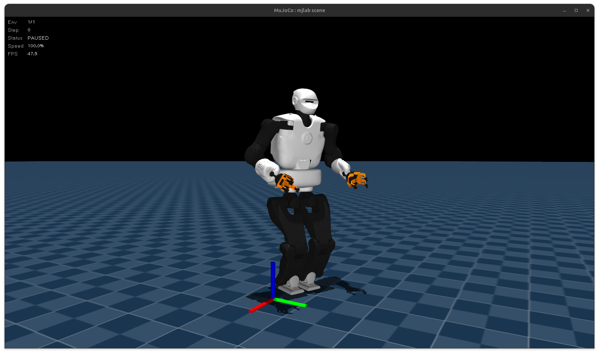
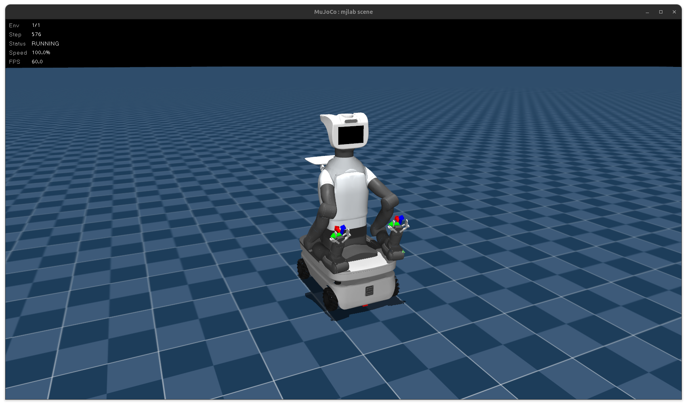
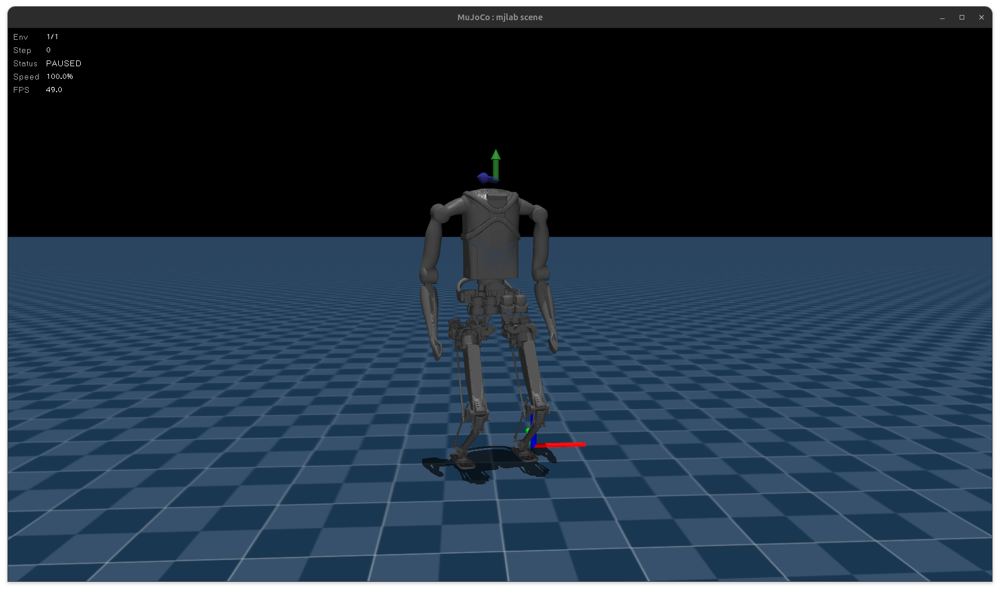
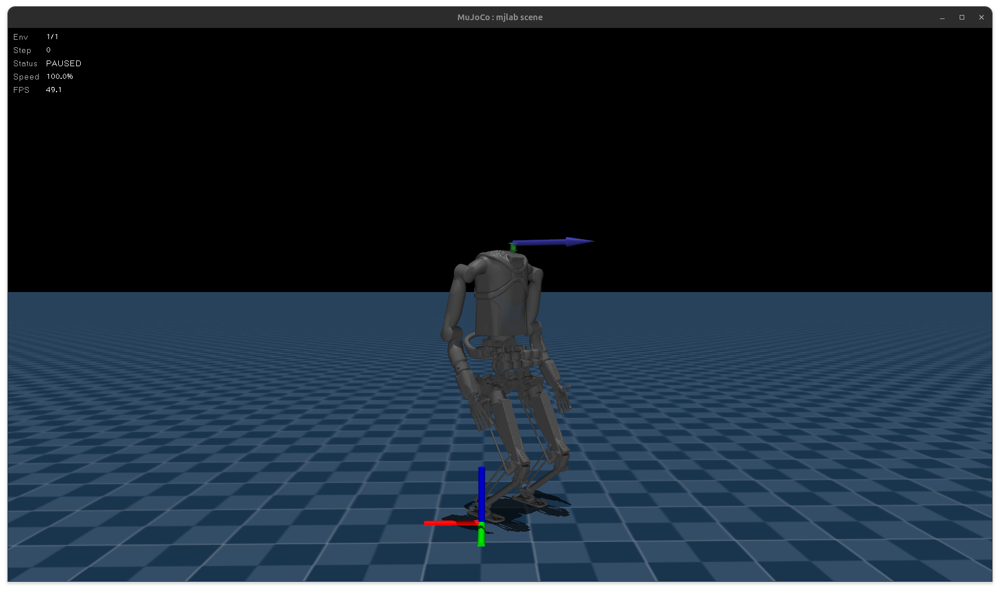
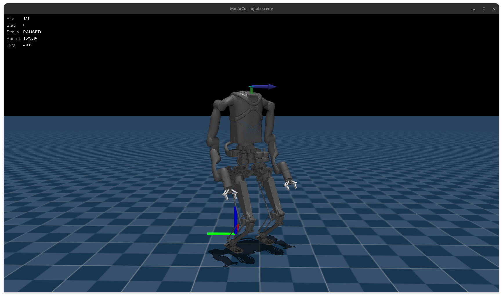

# 🤖 Robot Roster

Welcome to the robot registry! Below is a list of all active robotics hardware currently managed in this repository.

<table>
  <thead>
    <tr>
      <th>Robot Name</th>
      <th>Description</th>
      <th>Picture</th>
    </tr>
  </thead>
  <tbody>
    <tr>
      <td><strong>Talos</strong></td>
      <td> -- </td>
      <td>
        
      </td>
    </tr>
    <tr>
      <td><strong>TIAGo Pro</strong></td>
      <td> -- </td>
      <td>
        
      </td>
    </tr>
    <tr>
      <td><strong>KANGAROO (Base)</strong></td>
      <td>Simplified model featuring 4 DoF per arm and a fake forearm.</td>
      <td>
        
      </td>
    </tr>
    <tr>
      <td><strong>KANGAROO (Hands)</strong></td>
      <td>Simplified model featuring 5 DoF per arm and integrated Seed Robotics hands.</td>
      <td>
        
      </td>
    </tr>
    <tr>
      <td><strong>KANGAROO (Gripper)</strong></td>
      <td>Simplified model featuring 7 DoF per arm and end-effector grippers.</td>
      <td>
        
      </td>
    </tr>
  </tbody>
</table>
